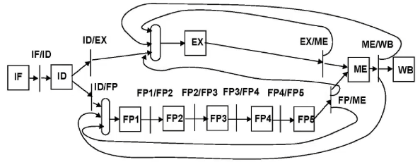
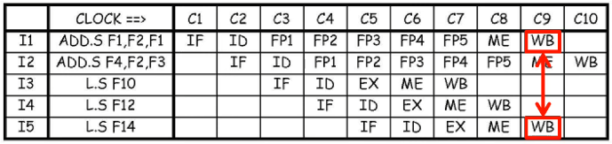
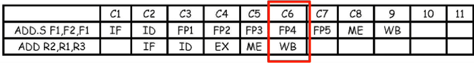
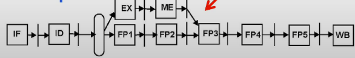
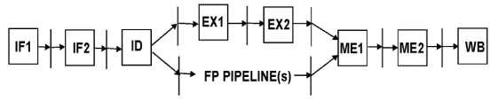
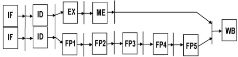
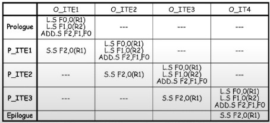

# Lecture 2

## Out-of-order pipelines



Problem: assumes that all operations execute in a single cycle
Has forwards from Memory stage to EX stage to eliminate RAW hazards
Two different register files: integer and FP
Instructions wait in ID until they can proceed without data hazards (RAW and WAW)
Still in-order execution but out-of-order completion

### Latency vs Repeat interval
Latency:
- Minimum number of cycles between an instruction producing a result and the instruction consuming it
- Dependent instruction must stall in ID until its operand is forwarded
- If FUs are linear pipelines then operation latency is execution time - 1

Repeat/Initiation interval:
- Number of cycles that must elapse between consecutive issues of isntructions to the same execution unit
- If a FU is not pipelined, two consecutive instructions may not be issued to it in consecutive cycles because of structural hazards

New FP capable pipeline:
| FUs | Latency | Initiation interval |
| --- | ------- | ------------------- |
| Integer ALU | 0 | 1 |
| Load | 1 | 1 |
| FP OP | 4 | 1 (5 if not pipelined) |

Latency for FP op is 4 because after op is loaded into FP1 it takes 4 more cycles until next instruction can enter FP1

### New structural hazards

With OOO-completion pipelines, multiple instructions can enter the same stage at the same time (FIFO)



I1 and I5 are in ME stage at the same time, but is not a hazard since I1 does not use Memory, only the WB is a structural hazard

Avoiding hazards in WB: add write-port to FP register file or stall the latter instruction in ID

Avoiding hazards in EX: add hardware resources or stall instructions

### New data hazards

WAW hazards on FP registers are now possible because they reach WB out of order

```asm
add.d   F2,F4,F6
L.D     F2,0(R2)
```
^^ The Load instruction must stall in ID

WAR hazards are not problem because reads happen on upswing of the clock and writes happen on the downswing of the clock.

Memory instructions do not induce hazards since they use the same FU.

### Precise exceptions

A precise exception: an event that is external to the exection such as an interrupt or an internal error such as division by 0 in an FP unit. All instructions before the instruction that created the exception should finish executing. All instructions after should have no effect.

```asm
i1: add.s F1,F2,F1
i2: ADD R2,R1,R3
```

Exceptions may happen out of program order 



**Solution**
Give state to software and let software figure it out. Not feasable for complex pipelines
Or support two operational modes:
- Slow: No pipelining, all exceptions enabled (debugging mode)
- Fast: Pipelining, some exceptions are disabled

Deal with exceptions as if they were hazards
- Do not issue an instruction in ID until it is sure that all prior instructions are exception free
- Detect exceptions as early as possible in the execution
- May stiffle pipelining

Force in-order completion


## Superpipelining and superscalar processors

### Superpipelined CPU



Some stages in the 5-stage pipeline are further pipelined
- to increase clock rate
- IF, EX, ME are now 2 stages
- Clock is 2x faster

NOTE:
- Branch penalty when taken is now 3 cycles
- Latencies counter in cycles are higher

Assuming unchanged 5-stages for FP
| FUs | Latency | Initiation interval |
| --- | ------- | ------------------- |
| Integer ALU | 1 | 1 |
| Load | 3 | 1 |
| FP op | 4 | 1 (5 if not pipelined) |

### Superscalar CPU



Try to do everything 2 times per cycles
- Same clock rate as basic pipeline
- Easy because of the 2 register files (INT and FP)

Issue a pair of instructions:
- Pair must be integer/branch/memory AND FP (compiler stuff)
- Instruction pair must be independent and have no hazards with prior instructions
- Same latencies as a basic ippeline, branches execute in EX
- Exceptions are more complex to deal with

Hard to build more than 2-way

## Static Instruction Scheduling

### Static Branch Prediction

Hardwired branch prediction:
- Always predict untaken and execute in EX
- Branches at the bottom of a loop are mostly mispredicted
- No compiler assist is possible
- Could predict taken, but not very useful (50/50 chance)
- Decisions made at design time

Compile-time branch prediction
- Each branch instr. has a hint-bit set by the compiler
- Compiler profiles the code and sets hint-bits
- Taken/Not-taken is much more flexible

### Static Instruction Scheduling

To maximize IPC of static pipelines
Compiler schedules instructions in code chunks
- Local (basic block level)
  - Reorder instructions inside a block
- Global (across blocks):
  - Loop unrolling
  - Software pipelining

**Local scheduling**

```c
for (i = 0; i < 100; i++)
    A[i] = A[i] + B[i]
```

Unoptimized code for basic pipeline (latency in paranthesis):

```asm
Loop    L.S     F0,0(R1) (1)
        L.2     F1,0(R2) (1)
        ADD.S   F2,F1,F0 (2) # hazards between F1 and F2
        S.S     F2,0(R1) (5)
        ADDI    R1,R1,#4 (1)
        ADDI    R2,R2,#4 (1)
        SUBI    R3,R3,#1 (1)
        BNEZ    R3,Loop  (3)
```
Solution: reorder instructions (ezpz)

### Global Static Instructions Scheduling: Loop unrolling

Works well if iterations are independent

### Software pipelining:

Original code is translated into a pipelined loop
- Pipelines dependent instructions in different iterations
  
Application to the simple loop:
- Since the ADD.S is the long latency operation, we can pipeline two loads and the ADD.s with the store


- Note that exactly the same oeprations are executed in exactly the same order in both the original and the pipelined loop
- The code is only reorganized

The prologue initiates the software-pipelined loop

### Limits of static pipelines

Good:
- Hardware simplicity: clock rate advantages over complex designs
- Predictable: static performance predictions are reliable
- Compiler has global view to optimize loops
- Power/energy advantage
- Good target for embedded systems

Bad:
- Dynamic events (cache misses and conditional branches)
- Freeze the processor on a miss (can't deal with latency tolerance)
- Lack of dynamic information (memory addresses and pointers)
- No good solutions for precise exceptions