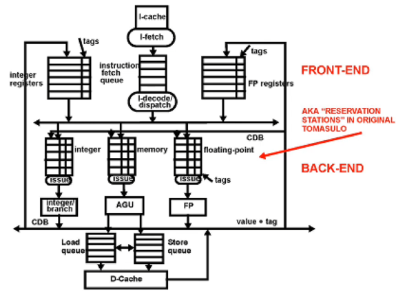

# Lecture 3

## Instruction scheduling techniques

Dynamically scheduled pipelines:
- Tomasulo's algorithm
- Speculative execution
- Dynamic branch prediction

### Dynamic instruction scheduling

Static pipelines can only exploit the parallelism exposed to it by the compiler
- Instructions are staleld in Id until they are hazard-free
- The compiler strives to limit the number of stalls in ID
- However, compiler is limited in what it can do

Potentially there is a large amount of ILP to exploit across 100s of instructions
- Must cross basic block boundaries (10s of branches)
- Data-flow order (dependencies) - not program order

Dynamic scheduling:
- Decode instructions then dispatch them in queues where they wait to be scheduled until input operands are available
- No stall at decode for data hazard - only structural hazards

Challenges with ILP:
- All data hazards (RAW, WAW, WAR) are now possible both on ME and registers must be avoided
- Execute beyond cond. branches (spec. exec)
- Enforce the precise exception model

## Tomasulo's algorithm


*AGU: address generation unit*

Decode/dispatch vs decode (regular pipeline): Tomasulo's dispatch only checks that a FU is available and the instr. is then moved to that FU.
Tomasulo's algorithm supports N number of FUs

If instr in FU queue has available operands it is moved to execution from queue.

Load-store queues: goes to D-cache

In static pipelines instrs are ready in the ID stage, Tomasulo has reservation stations which is a queue of fetched instructions

CDB: Common data bus

**Front-end**
- Instructions are fetched and stored in a FIFO queue (IFQ)
- When an instructions reaches the top it is:
  - decoded and
  - dispatched to an Issue Queue (Integer/Branch, Memory or FP) even if some of its operands are being computed or not ready

**Back-end**
- Instructions in Issue Queues wait for their input operands and are scheduled when available
- Instructions execute in their FU and their result is put on the CDB
- All instrs in queues and all registers watch the CDB and grab the value they are waiting for

Operands produced are tagged with tags that are used to eliminate RAW, WAR and WAW hazards.

### Tomasulo: hazards

**Hazards on registers**
The output register is assigned a TAG (the Q entry number where instruction is dispatched)
- The tag is stored in the register file and is reclaimed when the instruction has written its value on the CDB and releases its Q entry
- The tag of the result is carried by the CDB and snooped by queues and by register files
- When tag match is detected the value is stored in Q or in register
  - Tag is invalidated in registers
  - Operand in instruction is valid

This is also a form of *dynamic register renaming*
Register values are renamed to Q entry numbers
Multiple values for the same register may be pending at any time

**Hazards on memory**

All types of hazards are possible on memory (RAW, WAR, WAW)
Load-store Q: staging buffer to solve memory hazards
- Stores are sokut ub 2 sub-instrs
- 1) compute addr
- 2) wait for data
- Both are dispatched to the memory and results are latched in the LSQ
- LS resolves memory hazards (memory disambiguation)

### Structural and control hazards

**Structural hazards**:
I-fetch must stall if the IFQ is full
Dispatch must stall if all entries in the Issue-Q or LSQ are occupied
Instructions cannot be issued in case of conflicts for the CDB or FUs

**Control hazards**:
Dispatcher stalls when it reaches a branch instr
Branches are dispatched to Integer issue queue as integer instr
They wait for their register operands and put outcome on CDB
- If untaken, then dispatch resumes from the IFQ
- If taken, then dispatch clears the IFQ and directs I-fetch to fetch the target instruction stream

**Note:** precise exceptions are not supported

### Tomasulo example:


Integer instr: 1 cycle
FP instr: 5 cycles

Each entry is a clock cycle number; fill table clock by clock
- instructions are issued and start execution out of order
- large overhead to manage instructions
- latency of operation is effectively increased
- structural hazards: CDB/FU conflicts
  - could take advantage of static scheduling
  - branch acts as barrier to parallelism

## Dynamic branch prediction

Resolving control hazards can take several cycles, and in Tomasulo no instructions will be dispatch until a branch is resolved. So more complex pipeline will lead to bigger branch penalty.

### Execution beyond unresolved branches

Speculative execution

**Basic block**: block of consecutive instructions with no branch and no target branch. Execution looks like a tree of possibilities


**All-path execution**: Execute all paths after branch and then cancel all but one path
- very hardware intensive
- hard to keep track of order of instructions
- unwanted exceptions

Solution: Predict branches and execute most likely path

### Dynamic branch prediction

Branch prediction buffer (BPB) accessed with instruction in I-fetch


If an instruction is a branch, use a portion of the PC register to access the BPB

**BPB**:
- Small memory indexed with LSB of PC in I-fetch
- Prediction is dropped if instruction is not a branch
- Otherwise the prediction bits are decoded into T/NT prediction
- Once the branch condition is known and it is incorrect
  - Rollback execution
  - Update prediction bits
- Aliasing in BPB (different branches affect each other's predictions)

### 1-bit predictor

Each BPB entry is 1 bit
- Bit records the last outcome of the branch
- Predicts that outcome is same as last outcome

```asm
Loop1:
  Loop2: 
  BEZ R2, Loop2
BEZ R3,Loop1
```

Always mispredict twice for every loop execution, once on entry and once on exit
The mispredict is unavoidable (loop count unknown)
But the next mispredict on entry could be avoided.

Solution: 2-bit predictor

### 2-bit predictor

2-bit Up-Down saturating counter in each entry of the BPB


Start-state: 00

Starts predicting the previous outcome if it has happened 2 times in a row

Taken: add 1
Untaken: subtract 1
- now it takes 2 mispredictions in a row to change the prediction
- for the nested loop, the misprediction at entry is avoided
- could have more than 2 bits but two bits cover most patterns
