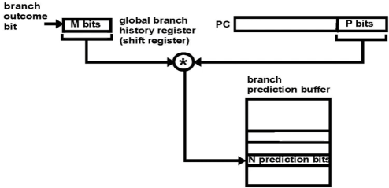
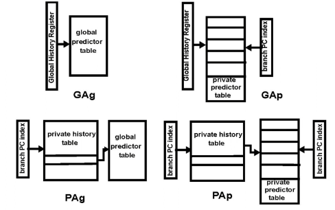
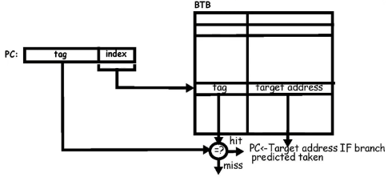
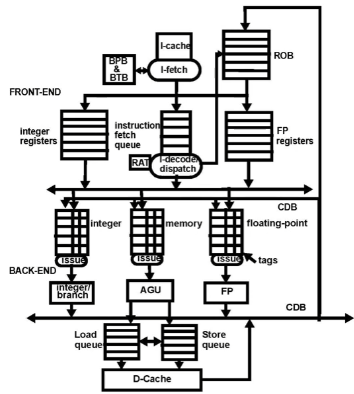
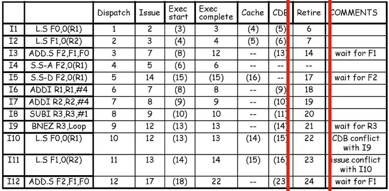
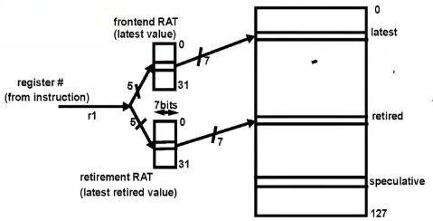
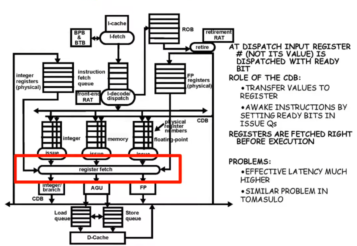

# Lecture 4

## Speculative Execution

### Correlating branch predictors

To improve on 2-bit predictors, we need to look at other branches than branches in loops

```c
if (a==2) { a = 0; }
if (b==2) { b = 0; }
if (a!=b) { ...; }
```

- If the first two conditions succeed, the 3rd will fail
- The 3rd branch is correlated with the first two
- Previous predictors track the history of each branch only

In general, a branch may behave differently if it is reached through different code sequences
- the code sequence can be characterized by the outcome of the latest branches to execute

Us N-bits of prediction and the outcomes of the last M barnches to execute

Global history: outcome of multiple branches
Local history: outcome of single branch

### (M,N) BPB

Outcome of the last **M** branches is the global branch history

Use N-bit predictor:
- BPB is indexed with P bits of the branch PC and M bits from the branch history register
- BPB size: N * 2^M * 2^P



Concatenate M bits with P bits to index the BPB

Global history is used to differentiate between various behaviors of a particular branch.

This can be generalized to 2-level predictors

### 2-level predictors



GAg: global history to index the global predictor table (not PC)
GAp: global history to index the private predictor table
PAg: private history to index the global predictor table
PAp: private history to index the private predictor table (like 2-bit predictors)

In a 2-level predictor we add history bits to access the BTB
- history can be global (all branches) or private (this branch only)

### Branch Target Buffer (BTB)

Aim: eliminate branch penalties
- need to know the target address by the end of I-fetch
- BTB: cache for all branch target addresses (no aliasing)



Tag-bits used to see if two or more branches that happen to end up on a PC with the same LSB, then we can use tags to distinguish them.

- Accessed in I-fetch in parallel with instruction and BPB entry
- Relies on the fact that the target address of a branch never changes: predicting indirect jumps
- Procedure return is a major cause of indirect jump
- Use a stack to track the stack of procedure calls

```c
for (i = 0; i < 100; i++)
    if (i % 2 == 0)
        a = 1;
    else
        a = 0; 
```

With a 6-bit branch history register, it would be 010101 or 101010 (impossible to know if it starts at 0 or 1)

## Hardware supported speculation

combination of 3 main ideas
- Dynamic OoO instruction scheduling with Tomasulo
- Dynamic branch prediction, allowing scheduling across branches and basic blocks
- Speculative execution: all control dependencies are resolved

hardware-based speculation usese a data-flow approach: instructions execute when their operands are available, across predicted branches

**Key ideas:**
- Separate the **completion** of instruction execution and the **commit** of its result
- Between completion and commit, results are speculative
- Commit the results to registers and storage in program order



New structures to tomasulo:
- Reorder buffer (ROB)
- Branch prediction buffer (BPB)
- Branch target buffer (BTB)

**ROB:**
- Keeps track of process order (FIFO)
- Holds speculative results
- No more snooping by registers

**Registers:**
- Pending in back-end
- Speculative in ROB
- Committed in the register file

Use ROB entry ID as TAG for renaming

Normal operation (no mispredicted branch, no exception):
**1) I-fetch**
- Fetch instruction
- Predict branches and their targets
- Fill the IFQ and the branch prediction
**2) I-decode/dispatch**
- Decode opcode
- Allocate 1 issue Q entry + 1 ROB entry + 1 LSQ entry
- Rename destination register (TAG) with ROB entry ID, mark "pending" in **Register Alias Table (RAT)**
- Fill input register operand field
  - If value is marked as pending in RAT, fill operand field with TAG (not ready)
  - If value is marked as completed in RAT, fetch value from ROB (ready)
  - If value is marked as committed in RAT, fetch value from register file (ready) 

**3) Issue**
- Wait in issue queue until all inputs are ready (snoop CDB)
- Issue in a cycle when conflicts for FU and CDB can be avoided

**4) Complete execution and write results**
- Result is written to the ROB via the CDB
- Destination register is marked completed in the RAT (speculative result, not committed)

**5) Commit/Graduate/Retire**
- Wait to reach the head of the ROB
- Write result to register or to memory (store)

**Branch misprediction**
- All instruction following the branch in the ROB must be flushed
- Wait until the branch reaches the top of the ROB and flush the ROB and flush all instructions in the back-end
- Instructions at the correct target are fetched

Exceptions can be handled similarly to branch mispredictions

## Memory disambiguation

Deals with hazards from reading and writing to memory

For load-stores we use the same approach as in Tomasulo
- Load/store instructions issue to LSQ through the AGU
- Stores are split into 2 instructions: address + cache access
- Each sub-instruction is allocated 1 issue queue entry

All WAW and WAR hazards are automatically solved because stores update the cache in process order when they reach the top of the ROB

Chech for RAW hazards in the LSQ before sending the load to cache
- Load can issue to cache as soon as it reaches the LSQ
- However, if a store with the same address is in front of the load in the LSQ then:
  - wait until store reaches the cache or return the value when it is ready

### Dynamic Memory disambiguation

Figuring out if two addresses are equal to avoid hazards
- Conservative approach:
  - A ready Load must wait in the LSQ until addresses of all stores preceding it in the LSQ is known
  - Problem: the situation where a load depends on a store in the LSQ is quite rara
- Optimistic approach: speculative disambiguation
  - Use mechanism in place for speculative execution (ROB + roll-back)
- speculative disambiguation
  - if a load is ready and stores with unknown addresses are in front of it in the LSQ
    - Speculatively assume that their addressese are different from the load's address
    - issue a load to cache
    - when the store's address has been computed and is ready, check all following loads in LSQ
    - if a load has the same address and is completed, the load and all following instruction must be replayed
- Intermediate
  - keep track that a load has violated in the past
  - treat a load conservatively; treat all other loads speculatively


New pipeline stage: **Retire**



Load can be dispatched right after the branch
Store to cache must wait until it reaches the top of the ROB

## Register renaming

### Explicit register renaming

ROB orders instruction commits and provides storage for speculative register values until they commit

Speculative register values may also be kept in physical registers
- Then the role of the ROB is limited to ordering instructions commits
- Physical registers are "shadow" registers keeping non-committed results

Large number of physical registers (more then # architectural registers - the registers visible from the ISA)

### Physical vs Architectural registers

Arch registers are mapped to physical registers dynamically, at any time one arch register may map to multiple physical registers

Arch registers are renuamed to physical at dispatch

Whenever a new value is stored in a register, a new physical register is allocated and the mapping is changed to point to this latest value

One physical register must hold the latest committed/retired value of each arch register

Physical registers must be reclaimed

ROB entry carries the mapping of arch to physical number

**Can't dispatch if all physical registers are allocated**

### Register renaming



Frontend RAT points to the most recent value
Retirement RAT points to most recent retied value (could be the same)
More speculative values of the same arch register may be in the regsiter file
"updating register" now means "updating the pointer in the retirement RAT"

**Algorithm**

When an instruction is dispatched its operands are renamed
- A physical register is allocated ot the destination register
- the frontend RAT is updated
- The physical register number mapped by the frontend is now the TAG used in tomasulo algorithm (not the ROB entry #)
- input register opearnds are mapped to their physical register through the frontend RAT
- if value is ready it is dispatched to the issue queue, otherwise the physical register number is dispatched (not ready)
- when an instruction retires, its destination physical register has the retired value and the retirement RAT is updated
  - previous physical register mapped by the retirement RAT is reclaimed




