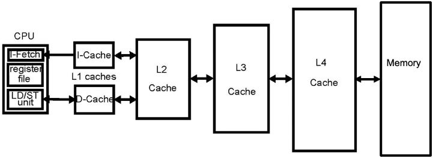
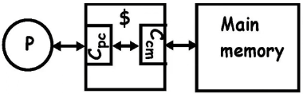
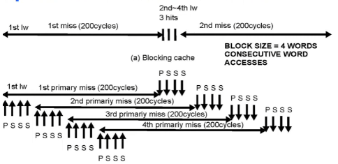
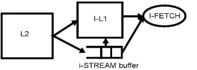
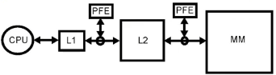

# Lecture 5

## Cache miss classification

3C's model
- Compulsory/cold misses
  - When a block has not been in the cache previously
- Capacity misses
  - When space is not sufficient to host data or code (for fully associative cache)
- Conflict misses
  - happen when two memory blocks map the same cache block in direct-mapped or set-associative caches

**Cold misses:** simulate infinite cache size
**Capacity misses:** simulate fully assoc cache, then deduct cold misses
**Conflict misses:** simulate cache, then deduct cold and capacity misses

OPT replacement policy: look into cache and replace block that is accessed furthest into the future.

## Impact of Cache organization on system performance

```txt
P <-> M_1 <-> M2
```

Average access time= $h_1*T_1 + m_1(T_1+T_2)$
$h_x$ = hit rate
$1-h_x$ = $m_x$ = miss rate
$T_x$ = hit time
$T_x+T_{x+1}$ = miss penalty

$CPI = CPI_0 + MPI_1 * T_2$

### Effects of cache params

Larger caches
- slower and longer hit times
- Less capacity misses

Larger block size
- Exploit spatial locality
- Too big a block increases capacity  misses
- Big blocks increase miss penalty

Higher associativity
- Reduces number of conflict misses
- 8-16 way set-assoc as good as fully assoc
- 2 way set assoc. cache of size N has similar miss rate as a direct-mapped cache of size 2N
- Higher hit time

## Multilevel cache hierarchies



1st, 2nd, 3rd level are on chip, 4th level is off chip

Cache inclusion is maintained when:
- a block misses in L1 then it must be brought into all levels
- a block is replaced in any level $L_1$, it must be removed from all levels where $L_j$ where $j<i$

Cache inclusion is good for coherence but can be wasteful

If a clean block is removed in a lower level, all upper level copies are marked as invalid
All replacements are silent and no write-backs needed

**Cache exclusion**
A block can only exist at one level
Good: improved utilization of cache space
Bad: complicates loading a block
Conditions:
- if a block is in $L_i$ then it is not in $L_j$, $j > i$
- if a block is in $L_1$ then all copies are removed from all $L_j$, $j > 1$
- if a block is replaced in $L_i$, then it is allocated in $L_{i+1}$

## Non-blocking/lockup-free caches

Non-blocking caches: can serve processor requests while handling 1 or several misses



$C_{cm}$: cache to memory interface
$C_{pc}$: processor to cache interface

If the cache misses, it does not block
- rather it handles the miss and keeps accepting accesses from the processor
- permits the concurrent processing of multiple misses and hits

Cache has to bookkeep all pending misses
- Miss Status Handling Registers (MSHRs) contain the address of pending miss, the destination block in cache and the destination register
- Number of MSHRs limits the number of pending misses

Data dependencies eventually block the processor

Non-blocking caches are required in dynamically scheduled processors and for prefetches

### Primary and secondary misses

Blocking caches only have primary misses

Primary: the first miss to a block
Secondary: Following acceses to blocks pending due to primary miss
- lot more misses
- needs MSHRs for both primary and secondary misses

Misses are overlapped with computation and with other misses

```asm
loop:   LW      R1,0(R2)
        ADDI    R2,R2,#4
        BNEZ    R2,R4,loop
```



Above is blocking cache, below is non-blocking

## Cache prefetching

Anticipate future cache misses

### Hardware prefetching

**Sequential prefetching of instructions**


- On an i-fetch miss, fetch two blocks instead of one
- second block is stored in an i-stream buffer
- if i-stream buffer hits, block is moved to L1
- i-stream buffer blocks are overlaid if not accessed
- also applicable to data, but less effective

**Hardware prefetching:** detect strides in streams of accesses and fetch ahead

Elements accessed at same offsets are very common and strided prefetching is good



### Compiler-controlled prefetching

- Insert prefetch instructions in code
- These are non-binding, load in cache only
- in a loop, we may insert prefetch instructions in the body of the loop to prefetch data needed in future loop iterations

```asm
loop:   l.d     f2,0(r1)
        pref    -24(r1) # offset for next fetch
        add.d   f4,f2,f0
        s.d     f4,0(r1)
        subi    r1,r1,#8
        bnez    r1,loop
```

What is required:
- can work for both loads and stores
- requires a non-blocking cache (blocking caches would block on pref instruction)
- causes instruction overhead (more instructions than really needed)
- data must be prefetched on time, so that they are present in cache at the time of access
- data may not be prefetched too early so that they are still in cache at the time of the access
- can easily be done for arrays, but is also possible to act on pointer access

cache needs to allocate one MHSR per prefetch instruction

## Virtual memory (unlucky)

Idea:
- memory protection between processes
- more flexible software:
  - possible to allocate larger virtual memory than physical memory available
  - relocation easier

virtual memory is mapped to physical memory

main memory acts as a cache for secondary memory (disk storage, when virtual > physical)

Where to place block/page: fully associative, page can be placed anywhere
How to find a block:
- look up in the page table
- on page fault, interrupt CPU and OS fetches from disk (same as cache miss)

Which block to replace:
- always LRU (or some approximation)

What happens on write?
- always write back
