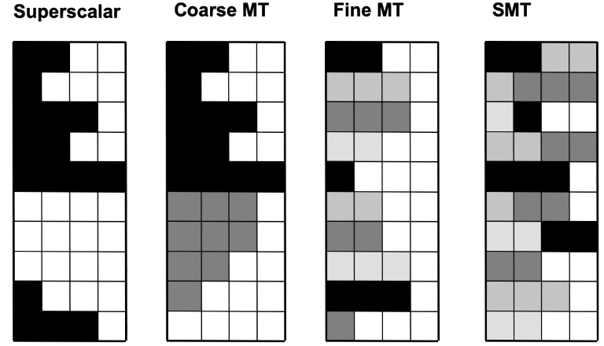
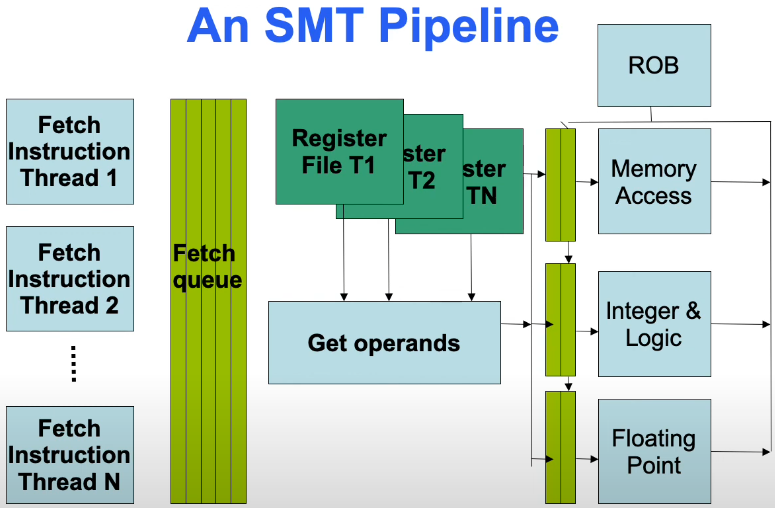

# Lecture 6

## Multithreading techniques

**Idea:** increase resource utilization by multiplexing the execution of multiple threads on the same pipeline

Fine-grained = switch context each cycle
Coarse-grained = switch context on costly stalls

### Simulatneous multithreading

## Cache coherence

**Performed**: a write is *performed* when the old value cannot be returned anymore
**Last globally written value**: assume that N processors in turn issue a write to location: W1,W2,...,Wn. If W1 is the last performed write, it leads to the last globally written value.

Memory coherence:
