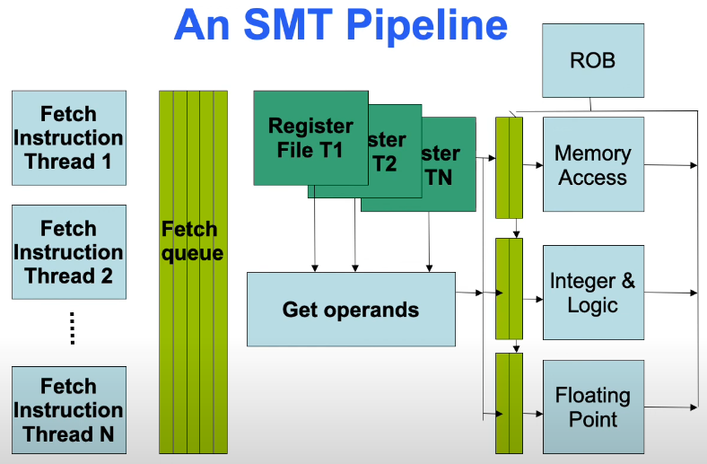
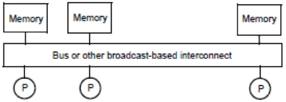
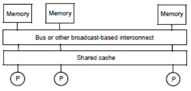
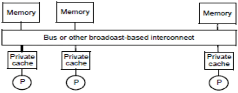
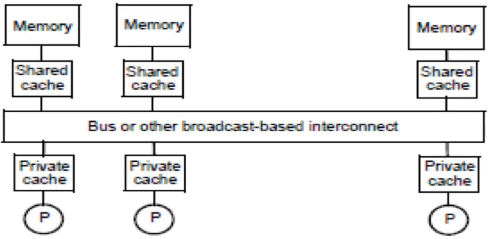
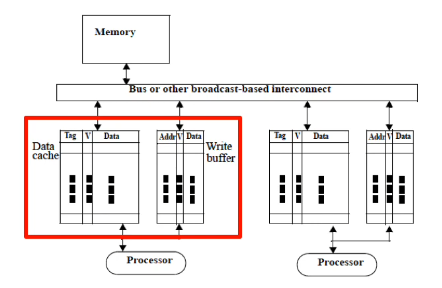
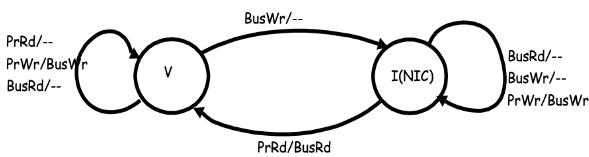
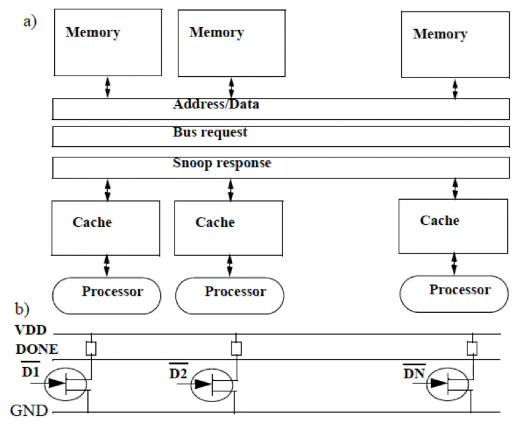
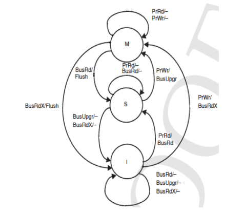

# Lecture 6

## Multithreading techniques

### Multicore and TLP

**Process:** a program that can run independently of other programs on a single or multiprocessor system

**Thread:** a piece of a program within a process that runs on a processor

### Multithreading

**Idea:** increase resource utilization by multiplexing the execution of multiple threads on the same pipeline

Long latency operation (like page-fault) switches thread to be executed

Fine-grained/interleaved: switch context each cycle
Coarse-grained: switch context on costly stalls (page-faults, cache miss)

**Superscalar**
4-issue machine, black colored squares are slots that are filled with instructions

**Coarse MT**
Go after inefficiency by switching to grey thread

**Fine-grained MT**
Switch every cycle to another program/color

**Simultaneous MT**
Run as many threads as possible in each cycle

- Each thread needs own register-files and fetches
- ROB must scale with amount of threads to support speculation

## Shared memory multiprocessors

- All processors share memory
- Challenge: how to provide low latency and high bandwidth for high processor counts

### Cache organizations

- Conceptual "dance-hall" model of shared memory multiprocessors
- No cache - not practical

- Shared first-level cache org
- advantage: constructive sharing
- disadvantage: interconnect between processors and cache on critical path

- private first-level cache org
- advantage: fast access
- disadvantage: multiple copies of the same data can exist

Private caches give rise to the cache coherence problem

- not sensitive to latency due to private cache
- enjoys constructive sharing

common in today's multicore chips

## Cache coherence problem

A write is **performed** when the old value cannot be returned anymore
Assume that N processors in turn issue a write to a location $W_1$, $W_2$, ..., $W_N$. If $W_1$ is the last performed write, it leads to the **last globally written value**.

Writes are performed when they change memory value, not when issued from processor

**Memory coherence:** at any point in time, all processors have a consistent view of the last globally written value to each memory location.

**Write-back caches**

Processors 1 and 2 do not see each other's modifications to a block

**Write-through caches**

Processor 1's write is propagated to memory but not sent to P2's cache

- Both cases: no consistent view of last globally written value
- need to devise a protocol that maintains cache coherence

### Cache coherence solutions

**Snoopy protocol**

Send invalidation to all processors that one processor wrote to a block/value

- same actions as a write-through cache for reads
- for writes, send invalidation request on the bus to all caches
- assume that we have a broadcast interconnect

**Implementation**

- add new bus transaction: invalidate
- invalidate is broadcast on writes and "snooped" by all cache controllers
- all copies of a block is invalidated

**State-transition diagrams**
- each cache is represented by a FSM
- imagine P identical FSMs working together, one per cache
- FSM represents the behavior of a cache w.r.t. a memory block
  - not a cache controller!

**Problem with snoopy protocol**

- Bus transaction on every wrtie
- consumes precious bus bandwidth
- especially troublesome for sequential programs that do not exchange data

**Write-invalidate protocol**
- build cache coherence protocol around write-back caches
- send invalidation only if there are copies

### Write-back caches and the MSI protocol

M - modified (bus upgrade)
S - shared/valid
I - invalid

