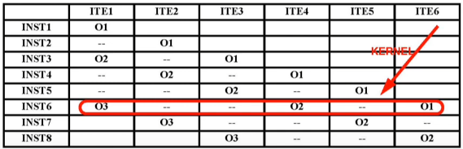

# Lecture 7

## Static scheduling

**Instruction scheduling:** compiler moves instructions
**Software register renaming:** for WAW and WAR hazards
**Memory disambiguation:** must be done by the compiler
**Branch prediction** scheme: static prediction
**Speculation:** speculate based on static branch prediction. test dynamically and execute patch-up/recovery code if the speculation fails

## VLIW architectures

Consists of multiple instructions that feed into FUs, reservation stations and queues are removed.


| instr prod. result | instr. using result | latency |
| --- | --- | --- |
| FP ALU op | FP ALU op | 2 |
| Load double | FP ALU op | 1 |
| Store double | Load double | 0 |
| int load | int alu op/branch | 1 |
| branch delay slot | N/A | 2 |


### Loop unrolling for VLIW
```asm
loop:   l.d     f0,0(r1)
        add.d   f4,f0,f2
        s.d     f4,0(r1)
        subi    r1,r1,#8
        bne     r1,r2,loop
        nop
```

Loop unrolled 7 times:


- the branch is delayed by two instructions to avoid flushing

### Software pipelining for VLIW

```asm
loop:   l.d     f0,0(r1) # O1
        add.d   f4,f0,f2 # O2
        s.d     f4,0(r1) # O3
```



Prologue: initiation of loop
Kernel: 